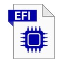

  

<h1 align="center">LENOVO-THINKCENTRE-EDGE72-EFI</h1>

  <b >LENOVO-THINKCENTRE-EDGE72   i5-3470S(Ivy Bridge)   HD5870    MACOSMontereyEFI</b>

  

  
# Used Kexts:
### AppleALC
### IntelMausi
### Lilu
### RealtekRTL8111
### SMCProcessor
### SMCSuperIO
### USBPorts
### VirtualSMC
### WhateverGreen

  

# Working MacOS:
### Monterey
### BigSur

  

# Planned Tests:
### Ventura
### Sonoma
